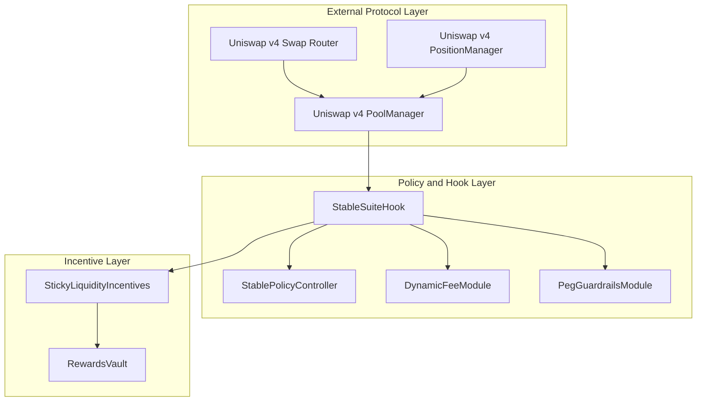
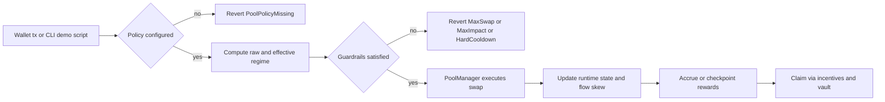
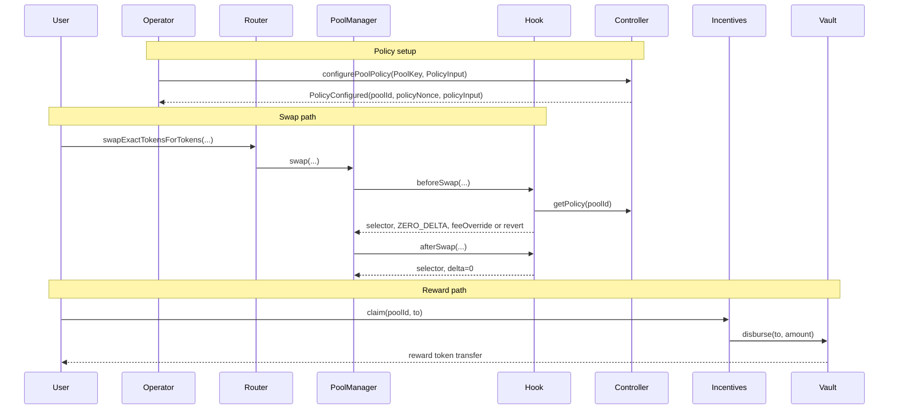
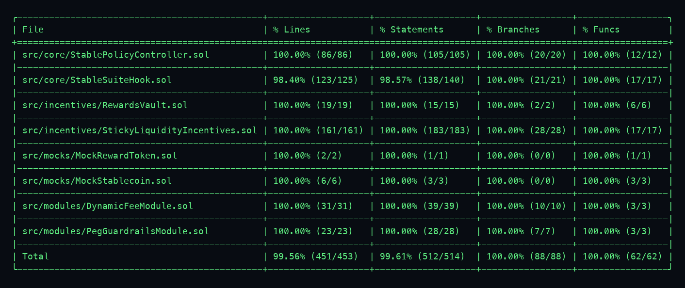

# Stable-Focused Hook Suite
**Built on Uniswap v4 · Deployed on Unichain Sepolia**
_Targeting: Uniswap Foundation Prize · Unichain Prize_

> Deterministic stablecoin liquidity protection for Uniswap v4 pools using on-chain regimes, guardrails, and sticky-liquidity incentives.


## The Problem
Stablecoin pools are most vulnerable during depeg stress, yet default AMM configurations are static. This leaves pools exposed to toxic flow, unstable regime transitions, and misaligned liquidity incentives.

| Layer | Failure Mode |
|---|---|
| Execution controls | No deterministic swap caps under stress |
| Fee logic | Static fee tier misses depeg risk |
| Regime switching | Boundary flapping from small alternating swaps |
| Liquidity incentives | Rapid add/remove can extract rewards unfairly |

The combined effect is poorer execution quality, LP inventory damage, and lower stable-pool resilience.

## The Solution
Stable Suite enforces deterministic stable-specific policy in the hook path on every swap.

1. `StableSuiteHook` loads per-pool policy from `StablePolicyController`.
2. Hook computes raw regime from on-chain tick distance, volatility proxy, and flow skew proxy.
3. `DynamicFeeModule.applyHysteresis(...)` prevents fast regime flapping.
4. `PegGuardrailsModule.enforceSwap(...)` applies `maxSwap`, `maxImpact`, and cooldown checks.
5. Hook returns fee override only when dynamic-fee pool mode is active.
6. Hook updates bounded runtime state (`smoothedVolatility`, `flowSkew`, regime timestamps).
7. Liquidity add/remove paths call incentives hooks with deterministic account attribution.
8. `StickyLiquidityIncentives` accrues rewards with O(1) checkpoints and `RewardsVault` disburses claims.

Core insight: stable-specific risk controls must execute inside swap callbacks, not off-chain automation.

## Architecture

### 8a. Component Overview
```text
src/
  core/
    StableSuiteHook.sol            # Regime computation, guardrails, swap/lp hook orchestration
    StablePolicyController.sol     # Policy storage, validation bounds, nonce/timelock governance
  modules/
    DynamicFeeModule.sol           # Raw regime selection and hysteresis transitions
    PegGuardrailsModule.sol        # Max swap, impact checks, and hard-regime cooldown
  incentives/
    StickyLiquidityIncentives.sol  # O(1) reward accounting, warm-up, penalty rules
    RewardsVault.sol               # Reward custody and restricted disbursement
  mocks/
    MockStablecoin.sol             # Demo stable assets for pool setup
    MockRewardToken.sol            # Demo reward funding asset
```

### 8b. Architecture Flow (Subgraphs)


### 8c. User Perspective Flow


### 8d. Interaction Sequence


## Regime Policy Engine
| Regime | Entry Condition | Enforced Controls | Exit Behavior |
|---|---|---|---|
| NORMAL | `absTickDistance <= band1` and low stress proxies | Lowest fee profile and widest limits | Can move to SOFT/HARD when thresholds trigger |
| SOFT_DEPEG | Between `band1` and `band2`, or soft proxy breach | Higher fee or tighter caps | Hysteresis gate blocks immediate return |
| HARD_DEPEG | Beyond `band2`, or hard proxy breach | Strictest caps plus cooldown | Must satisfy hysteresis and min time to exit |

Non-obvious behavior: effective regime may intentionally differ from raw regime due hysteresis and `minTimeInRegime`. This prevents micro-swaps from repeatedly toggling fee/guard settings.

## Deployed Contracts

### Unichain Sepolia (chainId 1301)
| Contract | Address |
|---|---|
| StableSuiteHook | [0x1b83f0BFbde508e6f38747b16c31de0E9b818aC0](https://sepolia.uniscan.xyz/address/0x1b83f0BFbde508e6f38747b16c31de0E9b818aC0) |
| StablePolicyController | [0x34A66707fB6ad5CdF364Bdf33D9078a52Eb621f8](https://sepolia.uniscan.xyz/address/0x34A66707fB6ad5CdF364Bdf33D9078a52Eb621f8) |
| StickyLiquidityIncentives | [0x89CB770a61937498d1D543134FFcfaDA8C612913](https://sepolia.uniscan.xyz/address/0x89CB770a61937498d1D543134FFcfaDA8C612913) |
| RewardsVault | [0x664EF5b793Dc491a3f0b8e85f124a6f76992C7DE](https://sepolia.uniscan.xyz/address/0x664EF5b793Dc491a3f0b8e85f124a6f76992C7DE) |
| MockStablecoin (currency0) | [0xA4b3922aE8de6F4c0e4f6a35768266100A93225a](https://sepolia.uniscan.xyz/address/0xA4b3922aE8de6F4c0e4f6a35768266100A93225a) |
| MockStablecoin (currency1) | [0xfB2C5dc538BFA424b6A966afda762344E801A43b](https://sepolia.uniscan.xyz/address/0xfB2C5dc538BFA424b6A966afda762344E801A43b) |
| MockRewardToken | [0x3D468cb2a4e447d5a7Cc5dd44179fb67ec27ee80](https://sepolia.uniscan.xyz/address/0x3D468cb2a4e447d5a7Cc5dd44179fb67ec27ee80) |

## Live Demo Evidence
Demo run date: **March 10, 2026**.

### Normal Peg Phase
| Action | Transaction |
|---|---|
| Approve token0 | [0x0b7b722c…](https://sepolia.uniscan.xyz/tx/0x0b7b722c669a3d5e8cd4419f5365c0f4d11b184a62117559b4916fbc6f4b5742) |
| Approve token1 | [0x2c9aa087…](https://sepolia.uniscan.xyz/tx/0x2c9aa087d43c6b743d993ad82ea105c15ca1d266729a569367b3d733406d7b60) |
| Normal swap | [0x452eaaf9…](https://sepolia.uniscan.xyz/tx/0x452eaaf98d65f4e831c8f1a1524b6223adfc51e2e32abf8489c5345d145535a9) |

### Depeg Stress Phase
| Action | Transaction |
|---|---|
| Configure stress policy | [0xb35555f8…](https://sepolia.uniscan.xyz/tx/0xb35555f819b3404fc0b9bfb86e8d50d8814035d289dfd51b5de31c1e0c66376d) |
| Hard-regime swap evidence | [0xe6695237…](https://sepolia.uniscan.xyz/tx/0xe66952375bfd36a9f145e8427feebf79ebccee9f87bb3f01f2266306f3f805cf) |

### Incentives Phase
| Action | Transaction |
|---|---|
| Claim rewards | [0xb6ab85cf…](https://sepolia.uniscan.xyz/tx/0xb6ab85cfdfe1c324ee466e83de729ca39984cc406ed5d116bcb50c0e587dbc7b) |

> Note: `lastHardSwapTimestamp`, `cooldownEndsAt`, and `cooldownActive` are read from chain state (`StableSuiteHook.runtime(poolId)`) and printed by `scripts/demo-testnet.sh`.

## Running the Demo
```bash
# Run full Unichain Sepolia demo
make demo-testnet
```

```bash
# Run normal-peg phase
make demo-normal
```

```bash
# Run depeg-stress phase
make demo-depeg
```

```bash
# Run incentives phase
make demo-incentives
```

```bash
# Run local deterministic demo
make demo-local
```

## Test Coverage
```text
Lines:      100.00%
Statements: 100.00%
Branches:   100.00%
Functions:  100.00%
```

```bash
# Reproduce strict source-coverage gate (accurate source mappings)
./scripts/check_coverage.sh
```

```bash
# Reproduce IR-minimum run (stack-too-deep fallback mode)
forge coverage --exclude-tests --ir-minimum --no-match-coverage '^(script/|src/helpers/|test/helpers/|test/utils/|lib/)'
```



> Note: Foundry warns that `--ir-minimum` can underreport line/statement source mappings.

- Unit and edge tests: policy bounds, permissions, swap boundaries.
- Fuzz tests: deterministic regime selection and valid swap behavior.
- Integration tests: full lifecycle from normal to depeg stress.
- Economic tests: rewards claimed remain bounded by funded amount.
- Coverage tests: path-level execution of all source branches.

## Repository Structure
```text
.
├── src/
├── scripts/
├── test/
└── docs/
```

## Documentation Index
| Doc | Description |
|---|---|
| `docs/overview.md` | Scope, assumptions, and system objective |
| `docs/architecture.md` | Contract boundaries and call graph |
| `docs/stable-regimes.md` | Bands, hysteresis, and regime transitions |
| `docs/guardrails.md` | Max impact, max swap, cooldown rationale |
| `docs/incentives.md` | Sticky-liquidity accounting and anti-gaming rules |
| `docs/security.md` | Threat model, mitigations, and residual risks |
| `docs/deployment.md` | Dependency pinning and deployment workflow |
| `docs/demo.md` | Demo phases and expected proof outputs |
| `docs/api.md` | Public interfaces and contract API reference |
| `docs/testing.md` | Test categories and CI coverage gate details |

## Key Design Decisions
**Why deterministic on-chain signals instead of off-chain oracles?**  
Regime correctness must not depend on an external feed being live during stress. Tick distance, volatility proxy, and flow skew are derived from pool-observable state, so decisions remain deterministic inside swap execution.

**Why O(1) accumulator rewards instead of iterating LPs?**  
Looping over LPs is not bounded and fails at scale. `StickyLiquidityIncentives` uses global accumulator and per-user checkpoints so claim complexity remains constant and predictable.

**Why hysteresis with minimum regime time?**  
Raw thresholds alone are easy to toggle with micro-flow. Hysteresis and minimum dwell-time intentionally slow exits so fee and guard regimes cannot be rapidly manipulated around boundaries.

## Roadmap
- [ ] Add external audit and publish report artifacts
- [ ] Add preset policy templates for major stable pairs
- [ ] Add governance handoff path with timelock defaults
- [ ] Add formal property tests for reward arithmetic invariants
- [ ] Add production telemetry for policy and risk monitoring

## License
MIT
