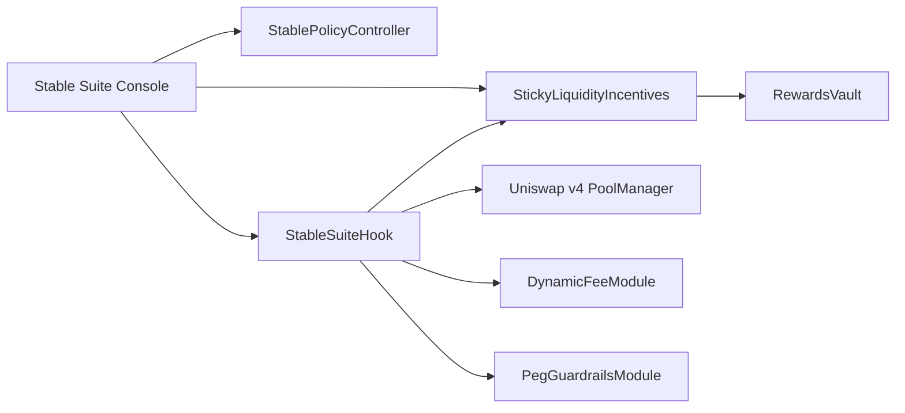
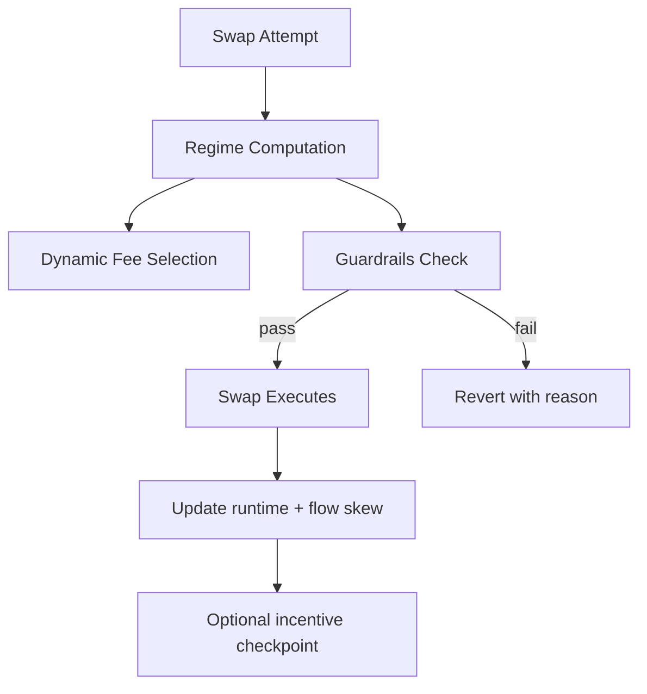
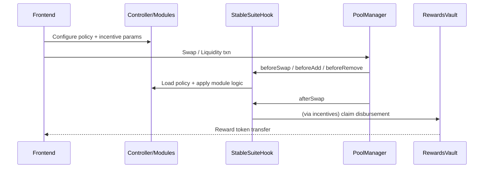

# Stable-Focused Hook Suite


Deterministic Uniswap v4 hook suite for stablecoin pools:

- Stable-specific execution guardrails for depeg stress
- Regime-based dynamic fee behavior from on-chain signals
- Sticky-liquidity incentives with warm-up and cooldown penalties
- No keepers, no bots, no reactive offchain dependencies

## Problem

Stablecoin pools are exposed to toxic flow during depeg transitions. Generic fee tiers and unconstrained swap paths can worsen execution quality and LP outcomes.

## Solution

Stable Suite enforces deterministic pool policy at hook-time:

1. Compute regime from tick distance to peg, rolling volatility proxy, and flow skew proxy
2. Apply regime-specific constraints (maxSwap, maxImpact, cooldown)
3. Apply dynamic-fee override where dynamic-fee pools are enabled
4. Maintain O(1) sticky-liquidity reward accounting

## Architecture







## Repository Layout

- `/src`: hook + policy + modules + incentives contracts
- `/test`: unit, edge, fuzz, integration tests
- `/script`: Foundry deploy/demo scripts
- `/scripts`: bootstrap, ABI export, demo automation
- `/shared`: ABI and TS artifacts for frontend/scripts
- `/frontend`: Stable Suite Console
- `/docs`: deep-dive documentation set

## Quickstart

```bash
make bootstrap
make test
make coverage
```

## Demo Commands

```bash
make demo-local
make demo-normal
make demo-depeg
make demo-incentives
make demo-all
```

Testnet demo (Base Sepolia preferred):

```bash
RPC_URL=<rpc> PRIVATE_KEY=<pk> TOKEN0=<addr> TOKEN1=<addr> REWARD_TOKEN=<addr> make demo-testnet
```

## Determinism and Assumptions

- Regime correctness uses only on-chain state (no external oracle required).
- Dynamic fee mutation requires dynamic-fee pool configuration (`fee = 0x800000`).
- Max-impact checks are enforced for custom price limits; router default global bounds rely on maxSwap + regime logic.
- `/context/uniswap_docs` was treated as the primary v4 reference.
- `/context/atrium` was not present in this repository.

## Security Snapshot

Key controls:

- `onlyPoolManager` on all hook entrypoints
- policy-bound validation on updates
- hysteresis + minimum regime time
- reentrancy guard on vault payout paths
- O(1) reward accumulator with budget caps (`claimed <= funded`)

See:

- [docs/security.md](docs/security.md)
- [SECURITY.md](SECURITY.md)

## Documentation Index

- [docs/overview.md](docs/overview.md)
- [docs/architecture.md](docs/architecture.md)
- [docs/stable-regimes.md](docs/stable-regimes.md)
- [docs/guardrails.md](docs/guardrails.md)
- [docs/incentives.md](docs/incentives.md)
- [docs/security.md](docs/security.md)
- [docs/deployment.md](docs/deployment.md)
- [docs/demo.md](docs/demo.md)
- [docs/api.md](docs/api.md)
- [docs/testing.md](docs/testing.md)
- [docs/frontend.md](docs/frontend.md)

## Tradeoffs

- Strict guardrails can reduce throughput during severe stress (intentional fail-closed behavior).
- Incentive attribution depends on liquidity hook data for account mapping in generic periphery flows.
- Dynamic-fee benefits are strongest when pools are explicitly configured as dynamic-fee pools.
