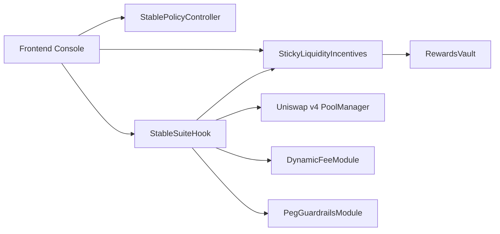

# Architecture

## System View

## Design Rules

- Only `PoolManager` can call hook entrypoints
- Policy config is owner/timelock guarded
- Incentive accounting is O(1) per user action/claim
- Reward distribution cannot exceed funded amount
